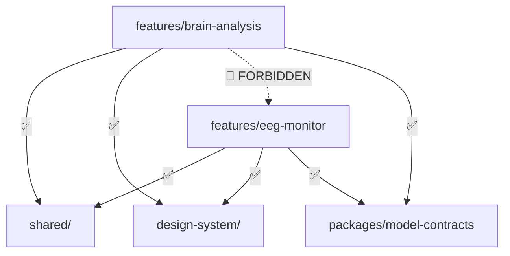
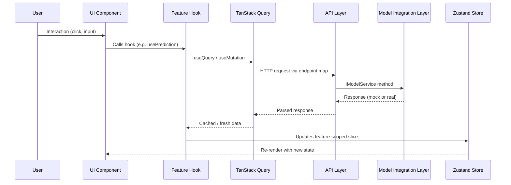

# Architecture — NeuroAegis

> Luxury glassmorphic AI command-center dashboard for Explainable AI (XAI) epileptic seizure detection.

---

## Tech Stack

| Layer | Technology | Role |
|---|---|---|
| Framework | React 18 + TypeScript | UI runtime + static type safety |
| Build | Vite | Dev server, HMR, ESM-native bundling |
| Styling | TailwindCSS (design tokens as CSS variables) | Utility-first styling with custom tokens |
| Components | shadcn/ui — restyled to glass / neon system | Copy-paste primitives; **never used bare** |
| Animation | Framer Motion | Declarative micro-interactions |
| Charts | Recharts **or** visx / D3 | Waveforms, ROC curves — **always themed, never default skins** |
| State | Zustand | Feature-scoped store slices |
| Async | TanStack Query | Caching, dedup, retry in front of API layer |
| Validation | Zod | Runtime boundary validation |
| Routing | React Router | Client-side navigation |

---

## The Five Layers

The architecture is organized into five physically separate layers on disk with **one-directional** dependency flow:

```
ui components → hooks (business logic) → api layer → model integration layer
```

| # | Layer | Responsibility |
|---|---|---|
| 1 | **UI Components** | Dumb, presentational, props-only. No fetching, no business rules. |
| 2 | **Business Logic** | Feature hooks (`usePrediction`, `useEEGStream`, …) that shape raw data for the view. |
| 3 | **API Layer** | HTTP / query client + endpoint definitions. Talks to mocks today, real backend later — transparently. |
| 4 | **State Management** | Zustand slices, one per feature. No cross-feature coupling. |
| 5 | **Model Integration Layer** | The **only** code that knows a model exists. Everything else calls it through `IModelService`. |

> [!IMPORTANT]
> Dependencies always flow **downward** through these layers. A lower layer must never import from a higher one.

---

## Dependency Rules

1. `shared/` and `design-system/` may be imported by **anyone**.
2. `features/*` may **NEVER** import another `features/*` folder directly.
3. UI components never fetch data or contain business logic.
4. All data contracts live in `packages/model-contracts` — **never redefined locally**.



> [!CAUTION]
> Cross-feature imports create hidden coupling. If `brain-analysis` needs data from `eeg-monitor`, lift the shared concern into `shared/` or coordinate through the Zustand store — never import across feature boundaries.

---

## Data Flow

```
User Interaction
    ↓
UI Component (presentational, props-only)
    ↓
Feature Hook (usePrediction, useEEGStream, etc.)
    ↓
TanStack Query (caching, dedup, retry)
    ↓
API Layer (core/services/api/) — endpoint map + HTTP client
    ↓
Model Integration Layer (core/services/model/ModelService.ts)
    ↓
Mock Data (core/services/model/mock/*) ←→ [TODO: Real Model Backend]
    ↓
Zustand Store (feature-scoped state slice)
    ↓
UI Component re-renders with new data
```



---

## Folder Structure

```
neuroaegis-dashboard/
├── apps/
│   └── web/
│       ├── src/
│       │   ├── app/                          # Shell: routing, providers, layout
│       │   │   ├── App.tsx
│       │   │   ├── routes.tsx
│       │   │   ├── providers/
│       │   │   │   ├── QueryProvider.tsx
│       │   │   │   ├── ThemeProvider.tsx
│       │   │   │   └── StoreProvider.tsx
│       │   │   └── layout/
│       │   │       ├── TopNav.tsx
│       │   │       ├── Sidebar.tsx
│       │   │       └── DashboardShell.tsx
│       │   │
│       │   ├── features/                     # Self-contained, independently replaceable
│       │   │   ├── brain-analysis/
│       │   │   │   ├── components/
│       │   │   │   ├── hooks/
│       │   │   │   ├── api/
│       │   │   │   ├── types/
│       │   │   │   ├── store/
│       │   │   │   └── index.ts
│       │   │   ├── eeg-monitor/
│       │   │   ├── frequency-analysis/
│       │   │   ├── seizure-prediction/
│       │   │   ├── explainability/
│       │   │   ├── reports/
│       │   │   ├── patients/
│       │   │   └── settings/
│       │   │
│       │   ├── shared/                       # Reusable primitives — no feature coupling
│       │   │   ├── components/
│       │   │   ├── hooks/
│       │   │   ├── utils/
│       │   │   ├── constants/
│       │   │   └── types/
│       │   │
│       │   ├── core/                         # Infrastructure services
│       │   │   ├── services/
│       │   │   │   ├── api/
│       │   │   │   ├── model/
│       │   │   │   │   ├── ModelService.ts
│       │   │   │   │   ├── ModelService.interface.ts
│       │   │   │   │   ├── mock/
│       │   │   │   │   └── config/
│       │   │   │   └── mock/
│       │   │   ├── state/
│       │   │   └── validation/
│       │   │
│       │   ├── design-system/                # Tokens, primitives, global theme
│       │   │   ├── tokens/
│       │   │   ├── primitives/
│       │   │   └── theme.css
│       │   │
│       │   ├── assets/
│       │   ├── styles/
│       │   └── main.tsx
│       │
│       ├── public/
│       ├── index.html
│       ├── package.json
│       ├── tsconfig.json
│       ├── tailwind.config.ts
│       └── vite.config.ts
│
├── packages/
│   └── model-contracts/                      # Shared data contracts — source of truth
│       ├── src/
│       │   ├── index.ts
│       │   ├── prediction.types.ts
│       │   ├── explanation.types.ts
│       │   ├── eeg.types.ts
│       │   ├── metrics.types.ts
│       │   └── alerts.types.ts
│       └── package.json
│
├── docs/
├── .env.example
├── README.md
└── package.json
```

### Key Directories

| Directory | Purpose |
|---|---|
| `apps/web/src/app/` | Application shell — routing, providers, layout chrome |
| `apps/web/src/features/` | Feature modules — each self-contained with its own components, hooks, API, types, and store |
| `apps/web/src/shared/` | Cross-cutting utilities and components with **zero** feature awareness |
| `apps/web/src/core/` | Infrastructure services — API client, model integration, state setup, validation |
| `apps/web/src/design-system/` | Design tokens, themed primitives, global CSS theme |
| `packages/model-contracts/` | Canonical TypeScript types for all model data contracts |

---

## Why This Shape

| Principle | How the Architecture Achieves It |
|---|---|
| **Features are deletable** | Each `features/*` folder is self-contained. Removing one does not break the app. |
| **Model swaps cleanly** | The model swaps by editing one folder: `core/services/model/`. All consumers use `IModelService`. |
| **Design tokens are decoupled** | Tokens live in `design-system/tokens/`, consumed via CSS variables — independent of component code. |
| **Types are centralized** | `packages/model-contracts` is the single source of truth. A backend team can codegen against it independently. |
| **No cross-feature coupling** | `shared/` provides reusable primitives without features ever referencing each other. |

---

## Tech Stack Rationale

| Choice | Rationale |
|---|---|
| **Vite** | Fast HMR, ESM-native, ideal for single-page dashboard development. |
| **TailwindCSS** | Utility-first approach pairs well with custom design tokens; avoids CSS-in-JS runtime overhead. |
| **shadcn/ui** | Copy-paste components restyled to the glass / neon system — no runtime dependency on a component library. |
| **Zustand** | Minimal boilerplate, no providers needed, naturally supports feature-scoped slices. |
| **TanStack Query** | Handles caching, deduplication, retry, loading / error states for all async data transparently. |
| **Zod** | Runtime type validation at data boundaries (API responses, model outputs) — catches contract drift early. |
| **Framer Motion** | Declarative animation API that delivers the premium micro-interaction feel the glassmorphic design demands. |
| **Recharts / visx** | Composable chart primitives that can be fully themed to match the NeuroAegis design system. |
