# NeuroAegis — Build Phases

> **Document**: Build Phases with Hard Gates
> **Version**: 1.0
> **Last Updated**: 2026-07-18

---

> [!IMPORTANT]
> Every phase boundary is a **hard gate**. A phase **cannot** begin until every exit criterion of the preceding phase is satisfied. No exceptions — partial completion does not unlock the next phase.

---

## Phase Overview

| Phase | Name | Scope Summary |
|:-----:|:-----|:--------------|
| 0 | Foundations | Governance docs, scaffold, install stack |
| 1 | Design System | Tokens, glass primitives, typography, motion, `theme.css` |
| 2 | Shell & Nav | TopNav, Sidebar, DashboardShell, routing |
| 3 | Core Layer | API skeleton, `ModelService` + interface + mocks, stores, contracts |
| 4 | Feature Modules | All features wired, 4-state coverage |
| 5 | Hero Visualization | Holographic 3D brain, particles, rings |
| 6 | Polish | Micro-interactions, responsive, accessibility |
| 7 | Model-Readiness Review | Audit all `TODO` markers, Definition of Done |

---

## Phase 0 — Foundations

### Scope

9 governance documents, project scaffold, full dependency stack installation.

### Entry Criteria

- [ ] Specification document is **finalized** and locked.

### Tasks

| # | Task | Detail |
|:-:|:-----|:-------|
| 0.1 | Write governance docs | Produce all 9 documents (MEMORY, PRD, ARCHITECTURE, DESIGN_SYSTEM, API_CONTRACTS, PHASES, CONVENTIONS, DASHBOARDSHELL, DASHBOARD_FEATURE_SPECS). |
| 0.2 | Scaffold folders | Create the complete folder structure matching the spec. |
| 0.3 | Init Vite + React + TS | Initialize the project with Vite, React 18+, and TypeScript. |
| 0.4 | Install dependencies | `TailwindCSS`, `shadcn/ui`, `Framer Motion`, `Recharts`, `Zustand`, `TanStack Query`, `Zod`, `React Router`, `Lucide React`. |
| 0.5 | Configure tooling | `tsconfig.json`, `tailwind.config.ts`, `vite.config.ts` — all aligned to spec. |
| 0.6 | Create `packages/model-contracts` | Define all TypeScript types from Section 7 of the spec. |
| 0.7 | Create `.env.example` | Template environment file with all required variables and placeholder values. |
| 0.8 | Create root `package.json` | Scripts for `dev`, `build`, `lint`, `typecheck`. |

### Exit Criteria

- [ ] All 9 governance documents exist and are internally consistent.
- [ ] Folder structure matches the spec exactly.
- [ ] `npm install` succeeds with zero errors.
- [ ] `tsc --noEmit` compiles with zero errors.

---

## Phase 1 — Design System

### Scope

Design tokens, glass primitives, shared typography, motion presets, and `theme.css`.

### Entry Criteria

- [ ] **Phase 0** exit criteria fully satisfied.

### Tasks

| # | Task | Detail |
|:-:|:-----|:-------|
| 1.1 | Define design tokens | Color palette, typography scale, spacing scale, motion/easing tokens. |
| 1.2 | Build `theme.css` | CSS custom properties, gradient definitions, texture overlays, noise layers, particle canvas base styles. |
| 1.3 | Glass primitives | `GlassPanel` — frosted container with blur + border. |
| | | `NeonBorder` — animated glow border component. |
| | | `HoloRing` — holographic ring visual element. |
| | | `ParticleField` — ambient floating particle canvas. |
| 1.4 | Shared UI components | `GlassCard` — card variant with glass styling. |
| | | `NeonBadge` — status badge with neon glow. |
| | | `StatusBadge` — semantic status indicator (normal / warning / critical). |
| | | `WaveformSparkline` — inline mini-waveform visualization. |
| | | `ConfidenceGauge` — radial/arc gauge for confidence scores. |
| | | `ShapBarChart` — horizontal bar chart for SHAP feature attributions. |

### Exit Criteria

- [ ] A blank themed shell renders correctly in the browser.
- [ ] All tokens are consumed via CSS custom properties — no hardcoded values.
- [ ] Every primitive and shared UI component renders in isolation without errors.

---

## Phase 2 — Shell & Nav

### Scope

`TopNav`, `Sidebar`, `DashboardShell` layout, and full route wiring.

### Entry Criteria

- [ ] **Phase 1** exit criteria fully satisfied.

### Tasks

| # | Task | Detail |
|:-:|:-----|:-------|
| 2.1 | `TopNav` | 72 px glass bar containing: logo, navigation links, search input, notification bell, profile avatar. |
| 2.2 | `Sidebar` | Collapsed icon-rail mode by default. Thin outline icons (Lucide). |
| 2.3 | `DashboardShell` | Layout wrapper composing `TopNav` + `Sidebar` + content area with proper spacing. |
| 2.4 | React Router routes | `Dashboard`, `Brain Analysis`, `Neural Activity`, `Reports`, `AI Models`, `Patients`, `Settings`. |
| 2.5 | Placeholder pages | One placeholder component per route to verify navigation. |
| 2.6 | Wire providers | Wrap app root with all required context providers (Router, QueryClient, Theme, Store). |

### Exit Criteria

- [ ] All 7 routes render their placeholder pages without errors.
- [ ] Navigation between all routes works via both `TopNav` and `Sidebar`.
- [ ] Glass styling on shell elements matches the Design System spec.

---

## Phase 3 — Core Layer

### Scope

API skeleton, `IModelService` interface, `ModelService` with mocks, Zustand stores, contract types.

### Entry Criteria

- [ ] **Phase 2** exit criteria fully satisfied.

### Tasks

| # | Task | Detail |
|:-:|:-----|:-------|
| 3.1 | API layer | Typed HTTP client abstraction + endpoint map. |
| 3.2 | `IModelService` interface | Define the interface exactly per spec — every method, parameter, and return type. |
| 3.3 | `ModelService` implementation | Implement against `IModelService` with mock data. Every real-API call site has a `// TODO: replace mock with real API call` marker. |
| 3.4 | Mock data generators | Predictions, EEG waveforms, frequency band values, evaluation metrics. |
| 3.5 | Latency & error simulation | 300–900 ms randomized latency on all mock calls. Global error-toggle for testing error states. |
| 3.6 | `model.config.ts` | Centralized model configuration (names, IDs, endpoints, feature lists). |
| 3.7 | Zustand stores | One store per feature domain (brain analysis, EEG, predictions, reports, settings, patients). |
| 3.8 | Zod schemas | Runtime validation schemas for all API response shapes. |
| 3.9 | TanStack Query wiring | Query keys, query functions, and mutation hooks consuming `ModelService`. |

### Exit Criteria

- [ ] `IModelService` is **fully implemented** — no missing methods.
- [ ] **Zero contract drift** between `IModelService`, `ModelService`, mock generators, and `model-contracts` types.
- [ ] Latency simulation (300–900 ms) is active and measurable.
- [ ] Error simulation toggle works — flipping it causes all calls to reject.

---

## Phase 4 — Feature Modules

### Scope

All feature panels wired and rendering with full 4-state coverage (loading, empty, error, success).

### Entry Criteria

- [ ] **Phase 3** exit criteria fully satisfied.

### Tasks

| # | Task | Detail |
|:-:|:-----|:-------|
| 4.1 | `brain-analysis` | Placeholder panel — visual slot reserved for Phase 5 hero visualization. |
| 4.2 | `eeg-monitor` | Real-time waveform panel rendering EEG channel data. |
| 4.3 | `frequency-analysis` | Line charts for Gamma, Beta, Alpha, Theta, and Delta frequency bands. |
| 4.4 | `seizure-prediction` | Per-model classification result + confidence score + model selector dropdown. |
| 4.5 | `explainability` | SHAP bar chart and waterfall chart for feature attributions. |
| 4.6 | `reports` | Evaluation metrics: Accuracy, Precision, Recall, F1 Score, ROC-AUC, Confusion Matrix. |
| 4.7 | `patients` | Stub panel — structure in place, data deferred. |
| 4.8 | `settings` | Stub panel — structure in place, configuration deferred. |
| 4.9 | Bottom metric cards | 5 cards: Signal Strength, Active Channels, Confidence, Session Duration, Alert Count. |
| 4.10 | Bottom timeline | Horizontal timeline bar for session/event navigation. |

> [!WARNING]
> **Every panel must implement all 4 states:**
>
> | State | Behavior |
> |:------|:---------|
> | **Loading** | Skeleton / shimmer placeholder matching panel dimensions |
> | **Empty** | Contextual empty-state message with icon |
> | **Error** | Error message with retry action |
> | **Success** | Full data rendering |

### Exit Criteria

- [ ] Every panel listed above exists as a component.
- [ ] All 4 states (loading, empty, error, success) are implemented for every panel.
- [ ] All panels are wired through `ModelService` — no direct data fetching or hardcoded data.

---

## Phase 5 — Hero Visualization

### Scope

Holographic 3D brain visualization with particles, rings, and bloom effects.

### Entry Criteria

- [ ] **Phase 4** exit criteria fully satisfied.

### Tasks

| # | Task | Detail |
|:-:|:-----|:-------|
| 5.1 | Floating holographic brain | Volumetric rendering with neuron nodes, synapse pulse animations, translucent shells, continuous slow rotation. |
| 5.2 | Bloom effects | Cyan and purple glow/bloom applied to brain surface and active regions. |
| 5.3 | Concentric rings | Orbital ring elements surrounding the brain visualization. |
| 5.4 | Ambient particles | Floating particle system in the brain viewport area. |
| 5.5 | Wire to `ModelService` | Brain state, active regions, and pulse data sourced from `ModelService`. **No one-off hardcoded data.** |
| 5.6 | Responsive behavior | Visualization scales and adapts to container size (desktop-first). |

### Exit Criteria

- [ ] Brain visualization renders entirely via `ModelService` / mock data path.
- [ ] Animation runs smoothly at 60 fps on target hardware.
- [ ] Visual output matches the spec (holographic aesthetic, bloom, rings, particles).
- [ ] No one-off data sources — all data flows through `ModelService`.

---

## Phase 6 — Polish

### Scope

Micro-interactions, responsive layout, accessibility, and visual audit.

### Entry Criteria

- [ ] **Phase 5** exit criteria fully satisfied.

### Tasks

| # | Task | Detail |
|:-:|:-----|:-------|
| 6.1 | Micro-interactions | Hover elevation lifts, animated border glows, particle bursts on state changes. |
| 6.2 | Waveform smoothness | EEG waveform rendering polish — smooth interpolation, no jank. |
| 6.3 | Route transitions | Framer Motion page transitions between routes. |
| 6.4 | Responsive pass | Desktop-first responsive layout. Verify all breakpoints, panel stacking, and text reflow. |
| 6.5 | Accessibility pass | Keyboard navigation, color contrast ratios, ARIA attributes, focus-visible indicators. |
| 6.6 | Visual audit | Side-by-side comparison against Section 5 of the spec. Flag and resolve all deviations. |

### Exit Criteria

- [ ] UI matches **Section 5** of the spec — no generic-dashboard aesthetic.
- [ ] **WCAG AA** baseline met (contrast, keyboard nav, ARIA, focus management).
- [ ] All micro-interactions are present and performant.

---

## Phase 7 — Model-Readiness Review

### Scope

Final audit of all `TODO` markers, contract compliance, and Definition of Done.

### Entry Criteria

- [ ] **Phase 6** exit criteria fully satisfied.

### Tasks

| # | Task | Detail |
|:-:|:-----|:-------|
| 7.1 | Grep all `TODO` markers | Search entire codebase for `// TODO:` comments. Catalog every instance. |
| 7.2 | Verify `IModelService` compliance | Every `TODO` must reference an `IModelService` method. No orphan TODOs. |
| 7.3 | Verify no `ModelService` bypass | No component fetches data outside of `ModelService`. No direct HTTP calls, no inline mock objects. |
| 7.4 | Verify no cross-feature imports | Feature modules do not import from other feature modules. Shared code lives in shared layers only. |
| 7.5 | Verify contract match | All `ModelService` method signatures and return types match `model-contracts` exactly. |
| 7.6 | Run Definition of Done checklist | Execute the full DoD checklist from governance docs. Every item must pass. |
| 7.7 | Update `MEMORY.md` | Record final state, known limitations, and model-integration readiness status. |

### Exit Criteria

- [ ] Every `TODO` satisfies `IModelService` — mock can be swapped for real implementation with zero component changes.
- [ ] **Nothing bypasses `ModelService`** — verified via grep and code review.
- [ ] **Definition of Done** is fully met with documented evidence.
- [ ] `MEMORY.md` is updated and reflects the final build state.

---

## Phase Gate Enforcement

```mermaid
graph LR
    P0["Phase 0<br/>Foundations"] -->|Gate| P1["Phase 1<br/>Design System"]
    P1 -->|Gate| P2["Phase 2<br/>Shell & Nav"]
    P2 -->|Gate| P3["Phase 3<br/>Core Layer"]
    P3 -->|Gate| P4["Phase 4<br/>Feature Modules"]
    P4 -->|Gate| P5["Phase 5<br/>Hero Viz"]
    P5 -->|Gate| P6["Phase 6<br/>Polish"]
    P6 -->|Gate| P7["Phase 7<br/>Model-Readiness"]

    style P0 fill:#0d1117,stroke:#00f0ff,color:#e6edf3
    style P1 fill:#0d1117,stroke:#00f0ff,color:#e6edf3
    style P2 fill:#0d1117,stroke:#00f0ff,color:#e6edf3
    style P3 fill:#0d1117,stroke:#7c3aed,color:#e6edf3
    style P4 fill:#0d1117,stroke:#7c3aed,color:#e6edf3
    style P5 fill:#0d1117,stroke:#a855f7,color:#e6edf3
    style P6 fill:#0d1117,stroke:#06b6d4,color:#e6edf3
    style P7 fill:#0d1117,stroke:#10b981,color:#e6edf3
```

> [!CAUTION]
> **No phase may be skipped or started early.** Each gate is binary — all exit criteria pass, or the phase is not complete. Partial progress in a downstream phase is a governance violation.
