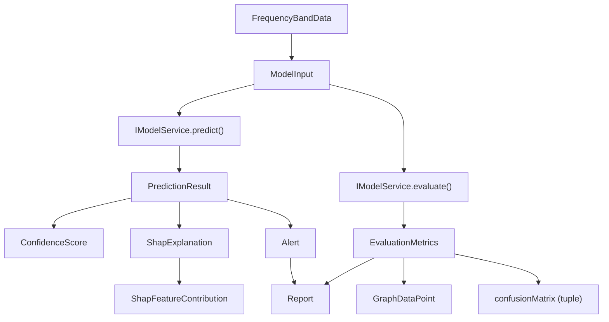

# Technical Requirements Document (TRD)

**Project:** NeuroAegis — Explainable AI Seizure Detection Dashboard  
**Version:** 1.0.0  
**Last Updated:** 2026-07-18  
**Status:** Approved

---

## Table of Contents

1. [Performance Budgets](#1-performance-budgets)
2. [Browser Support Matrix](#2-browser-support-matrix)
3. [Responsive Breakpoints](#3-responsive-breakpoints)
4. [Accessibility Requirements](#4-accessibility-requirements)
5. [Testing Strategy](#5-testing-strategy)
6. [Data Contracts](#6-data-contracts)
7. [Service Contract — `IModelService`](#7-service-contract--imodelservice)
8. [Mock Data Requirements](#8-mock-data-requirements)

---

## 1. Performance Budgets

All metrics are measured under simulated Fast 3G throttling against a cold cache on a mid-tier device (4× CPU slowdown).

| Metric | Budget | Measurement Tool |
|---|---|---|
| First Contentful Paint (FCP) | < 1.5 s | Lighthouse / Web Vitals |
| Largest Contentful Paint (LCP) | < 2.5 s | Lighthouse / Web Vitals |
| Time to Interactive (TTI) | < 3.0 s | Lighthouse |
| Total Bundle Size (gzipped) | < 500 KB | `vite build --report` |
| Animation Frame Rate | 60 fps | Chrome DevTools Performance panel |
| Mock Service Latency | 300–900 ms | Simulated via `MockModelService` |

### 1.1 Bundle Budget Breakdown

| Chunk | Max Size (gzipped) |
|---|---|
| Framework (React + ReactDOM) | ≤ 140 KB |
| UI / Glassmorphic Styles (CSS) | ≤ 40 KB |
| Charting Library (Recharts) | ≤ 120 KB |
| Application Code | ≤ 100 KB |
| Shared Utilities & Stores | ≤ 30 KB |
| Remaining Allowance | ≤ 70 KB |
| **Total** | **≤ 500 KB** |

### 1.2 Animation Performance Rules

- All CSS transitions and animations must use GPU-compositable properties only (`transform`, `opacity`, `filter`, `backdrop-filter`).
- JavaScript-driven animations must use `requestAnimationFrame`.
- No layout-triggering property animations (`width`, `height`, `top`, `left`, `margin`, `padding`).
- Glassmorphic `backdrop-filter: blur()` layers are limited to **3 concurrent visible layers** to preserve 60 fps on integrated GPUs.

### 1.3 Mock Latency Simulation

The `MockModelService` introduces artificial latency to mirror real-world inference timing:

| Operation | Simulated Latency |
|---|---|
| Single prediction request | 300–600 ms |
| Batch evaluation request | 500–900 ms |
| SHAP explanation generation | 400–800 ms |

> [!NOTE]
> Latency values are randomized uniformly within each range per call to prevent UI code from relying on deterministic timing.

---

## 2. Browser Support Matrix

NeuroAegis targets **desktop-class browsers** used in clinical research and monitoring environments.

| Browser | Supported Versions | Engine |
|---|---|---|
| Google Chrome | Latest 2 | Blink |
| Mozilla Firefox | Latest 2 | Gecko |
| Apple Safari | Latest 2 | WebKit |
| Microsoft Edge | Latest 2 | Blink |

### 2.1 Required CSS Features (No Fallback)

The following CSS features are **required**. No progressive-enhancement fallback is provided:

| Feature | CSS Property / Rule | Minimum Browser Version |
|---|---|---|
| Backdrop Blur | `backdrop-filter: blur()` | Chrome 76+, Firefox 103+, Safari 9+, Edge 79+ |
| CSS Custom Properties | `var(--*)` | All supported browsers |
| CSS Grid Layout | `display: grid` | All supported browsers |
| CSS `clamp()` | `clamp(min, val, max)` | All supported browsers |

> [!IMPORTANT]
> `backdrop-filter` is a hard requirement for the glassmorphic design language. Browsers or configurations that disable this property will receive a **broken visual experience**. No fallback (e.g., solid semi-transparent backgrounds) is implemented.

### 2.2 Unsupported Environments

| Environment | Status |
|---|---|
| Internet Explorer (all versions) | ❌ Not supported |
| Mobile browsers (all) | ❌ Out of scope |
| Embedded WebViews (Electron, Tauri) | ❌ Not tested |

---

## 3. Responsive Breakpoints

NeuroAegis is designed as a **desktop-first** command-center dashboard. Responsive behavior targets large screens with graceful narrowing down to tablet-landscape viewports.

| Breakpoint | Viewport Width | Classification | Behavior |
|---|---|---|---|
| Primary | ≥ 1280 px | Full Command Center | All panels visible, multi-column grid layout, full data density |
| Graceful | ≥ 1024 px | Condensed Desktop | Sidebar collapses, secondary panels stack, reduced chart density |
| Minimum | ≥ 768 px | Tablet Landscape | Single-column layout, modal overlays replace side panels |
| Below Minimum | < 768 px | **Out of Scope** | No responsive support; layout may break |

### 3.1 CSS Breakpoint Tokens

```css
:root {
  --bp-primary:  1280px;
  --bp-graceful: 1024px;
  --bp-minimum:    768px;
}
```

### 3.2 Media Query Convention

All responsive rules follow a **desktop-first** (`max-width`) strategy:

```css
/* Condensed desktop */
@media (max-width: 1279px) { /* … */ }

/* Tablet landscape — minimum supported */
@media (max-width: 1023px) { /* … */ }
```

> [!WARNING]
> Viewports below 768 px are **explicitly out of scope**. Mobile layouts are not designed, tested, or supported. The application may render in a degraded or unusable state on mobile devices.

---

## 4. Accessibility Requirements

NeuroAegis conforms to **WCAG 2.1 Level AA** standards to ensure usability for clinicians and researchers with disabilities.

### 4.1 Semantic HTML

- All page regions use landmark elements (`<header>`, `<nav>`, `<main>`, `<aside>`, `<footer>`).
- Headings follow a strict hierarchy (`h1` → `h2` → `h3`); no skipped levels.
- Interactive elements use native HTML controls (`<button>`, `<a>`, `<input>`) before resorting to ARIA roles.
- Data visualizations (charts, graphs) include descriptive `aria-label` attributes and an adjacent `<table>` or text summary for screen readers.

### 4.2 ARIA Attributes

| Pattern | Required ARIA |
|---|---|
| Glassmorphic cards | `role="region"`, `aria-labelledby` linked to card heading |
| Modal overlays | `role="dialog"`, `aria-modal="true"`, `aria-labelledby` |
| Alert banners | `role="alert"`, `aria-live="assertive"` |
| Status indicators | `role="status"`, `aria-live="polite"` |
| Confidence gauges | `role="meter"`, `aria-valuenow`, `aria-valuemin`, `aria-valuemax`, `aria-label` |
| Tabs / Tab panels | `role="tablist"` / `role="tab"` / `role="tabpanel"`, `aria-selected` |
| Sidebar navigation | `role="navigation"`, `aria-label="Primary navigation"` |
| Data tables | `role="table"` (if not native), `aria-sort` on sortable columns |

### 4.3 Keyboard Navigation

- All interactive elements are reachable via `Tab` / `Shift+Tab`.
- Modal dialogs implement **focus trapping**: focus cycles within the modal while open.
- `Escape` closes the topmost modal or popover.
- Arrow keys navigate within composite widgets (tabs, menus, table rows).
- Skip-to-content link is the first focusable element on every page.

### 4.4 Focus Indicators

NeuroAegis uses a distinctive **cyan glow** focus ring consistent with the glassmorphic design language:

```css
:focus-visible {
  outline: 2px solid var(--color-cyan-400, #22d3ee);
  outline-offset: 2px;
  box-shadow: 0 0 8px 2px rgba(34, 211, 238, 0.4);
}
```

| Requirement | Value |
|---|---|
| Focus ring color | `#22d3ee` (Cyan 400) |
| Focus ring width | 2 px solid |
| Focus ring offset | 2 px |
| Glow shadow | `0 0 8px 2px rgba(34, 211, 238, 0.4)` |
| High-contrast mode | Focus ring switches to `#ffffff` solid, no glow |

### 4.5 Reduced Motion Support

All animations and transitions respect the `prefers-reduced-motion` media query:

```css
@media (prefers-reduced-motion: reduce) {
  *,
  *::before,
  *::after {
    animation-duration: 0.01ms !important;
    animation-iteration-count: 1 !important;
    transition-duration: 0.01ms !important;
    scroll-behavior: auto !important;
  }
}
```

When `prefers-reduced-motion: reduce` is active:

- All CSS transitions collapse to instantaneous state changes.
- Canvas and SVG chart animations are disabled; charts render in their final state.
- Loading spinners switch to a static progress indicator.
- Pulsing alert animations are replaced with a persistent static icon.

### 4.6 Color Contrast Ratios

| Element Type | Minimum Contrast Ratio | Standard |
|---|---|---|
| Body text (normal) | 4.5 : 1 | WCAG AA |
| Large text (≥ 18 px or ≥ 14 px bold) | 3.0 : 1 | WCAG AA |
| UI components & graphical objects | 3.0 : 1 | WCAG AA 1.4.11 |
| Focus indicators | 3.0 : 1 against adjacent colors | WCAG AA 2.4.7 |

> [!TIP]
> Glassmorphic surfaces use semi-transparent backgrounds. Contrast ratios must be validated against the **worst-case** underlying content, not the average background. Test with both light and dark content behind glass panels.

---

## 5. Testing Strategy

### 5.1 Test Pyramid Overview

```
            ┌───────────┐
            │   E2E     │  Playwright
            │  (small)  │
          ┌─┴───────────┴─┐
          │  Integration   │  RTL + MockModelService
          │   (medium)     │
        ┌─┴───────────────┴─┐
        │     Unit Tests     │  Vitest
        │      (large)       │
        └────────────────────┘
```

### 5.2 Unit Tests — Vitest

**Scope:** Custom hooks, utility functions, Zustand stores, data transformers, validators.

| Target | Examples | Runner |
|---|---|---|
| Custom Hooks | `useConfidenceGauge`, `useShapValues`, `useAlerts` | Vitest + `@testing-library/react-hooks` |
| Utility Functions | `normalizeShap`, `formatConfidence`, `generateROCCurve` | Vitest |
| Zustand Stores | `usePredictionStore`, `useModelConfigStore` | Vitest |
| Data Validators | Input schema validators, TypeScript type guards | Vitest |

### 5.3 Component Tests — React Testing Library

**Scope:** React component rendering, user interaction, conditional display logic.

| Target | Testing Approach |
|---|---|
| Glassmorphic Cards | Renders with correct ARIA, displays data from props |
| Confidence Gauge | Renders at boundary values (0.0, 0.6, 0.98, 1.0) |
| SHAP Waterfall Chart | Renders correct number of feature bars, sorted order |
| Alert Banner | Appears on seizure detection, correct `role="alert"` |
| Confusion Matrix | Renders all four quadrants with correct labels |
| ROC Curve | Renders SVG path, responds to data changes |

### 5.4 Integration Tests — MockModelService

Integration tests wire components to `MockModelService` to validate end-to-end data flow without a real backend:

```
Component → Hook → Store → MockModelService → Store → Component (re-render)
```

| Scenario | Assertion |
|---|---|
| Prediction request lifecycle | Loading → Data → Render with correct confidence |
| Error handling | Service throws → Error boundary displays fallback UI |
| SHAP explanation flow | Request → Receive 5–8 features → Waterfall chart renders |
| Batch evaluation | Metrics returned → Confusion matrix + ROC curve render |
| Latency tolerance | UI remains responsive during 900 ms simulated delay |

### 5.5 End-to-End Tests — Playwright

**Scope:** Critical user journeys across the full dashboard.

| Test Suite | Scenarios |
|---|---|
| Dashboard Load | Cold start → FCP < 1.5 s, all panels render, no console errors |
| Prediction Flow | Trigger prediction → Loading state → Result with confidence + SHAP |
| Alert Lifecycle | Seizure detected → Alert banner → Dismiss → Alert log updated |
| Navigation | Sidebar nav → All routes reachable → Active state correct |
| Keyboard Navigation | Tab through all interactive elements → Focus indicators visible |
| Accessibility Audit | Automated axe-core scan → Zero AA violations |

### 5.6 Coverage Thresholds

| Category | Lines | Branches | Functions | Statements |
|---|---|---|---|---|
| Core (hooks, stores, services) | ≥ 80% | ≥ 80% | ≥ 80% | ≥ 80% |
| Feature Components | ≥ 60% | ≥ 60% | ≥ 60% | ≥ 60% |
| Utility Functions | ≥ 90% | ≥ 90% | ≥ 90% | ≥ 90% |
| E2E (not measured by coverage) | — | — | — | — |

> [!NOTE]
> Coverage is enforced in CI via Vitest's `--coverage` flag with `c8`. Builds fail if thresholds are not met.

---

## 6. Data Contracts

All data flowing between the UI, stores, and the model service layer is defined by the following TypeScript interfaces. These constitute the **single source of truth** for the NeuroAegis data layer.

### 6.1 `ModelInput`

Represents a single EEG sample submitted for seizure prediction.

```typescript
/**
 * A single EEG input sample for seizure prediction.
 * Contains the raw signal data, channel metadata, and recording context.
 */
export interface ModelInput {
  /** Unique identifier for this input sample. */
  readonly id: string;

  /** Unix timestamp (ms) when the EEG segment was recorded. */
  readonly timestamp: number;

  /**
   * Raw EEG signal values — one array per channel.
   * Outer array index = channel index; inner array = time-series samples.
   */
  readonly channels: readonly number[][];

  /** Human-readable labels for each channel (e.g., "Fp1", "Fp2", "C3"). */
  readonly channelLabels: readonly string[];

  /** Sampling rate in Hz (e.g., 256). */
  readonly samplingRateHz: number;

  /** Duration of the EEG segment in seconds. */
  readonly durationSec: number;

  /** Optional metadata tags for filtering and grouping. */
  readonly metadata?: Readonly<Record<string, string>>;
}
```

### 6.2 `ConfidenceScore`

A bounded confidence value with its classification label.

```typescript
/**
 * Confidence score for a seizure prediction.
 * Value is bounded to [0, 1].
 */
export interface ConfidenceScore {
  /** Predicted class label. */
  readonly label: "seizure" | "non-seizure";

  /**
   * Model confidence in the predicted label.
   * Range: [0, 1] where 1 = absolute certainty.
   */
  readonly value: number;

  /**
   * Confidence tier derived from value thresholds.
   * - "high":   value ≥ 0.85
   * - "medium": 0.60 ≤ value < 0.85
   * - "low":    value < 0.60
   */
  readonly tier: "high" | "medium" | "low";
}
```

### 6.3 `ShapFeatureContribution`

A single feature's SHAP contribution to a prediction.

```typescript
/**
 * SHAP contribution of a single input feature to the model's prediction.
 */
export interface ShapFeatureContribution {
  /** Human-readable feature name (e.g., "Delta Power (Fp1)"). */
  readonly featureName: string;

  /**
   * SHAP value for this feature.
   * Positive = pushes prediction toward "seizure".
   * Negative = pushes prediction toward "non-seizure".
   */
  readonly shapValue: number;

  /** Absolute value of shapValue, used for sorting by importance. */
  readonly absoluteImportance: number;

  /** The feature's raw input value for this specific prediction. */
  readonly featureValue: number;

  /** Unit of measurement for the feature value (e.g., "µV²/Hz", "ratio"). */
  readonly unit: string;
}
```

### 6.4 `ShapExplanation`

The complete SHAP explanation for a single prediction.

```typescript
/**
 * Full SHAP explanation for a single prediction result.
 * Contains the base value and all feature contributions.
 */
export interface ShapExplanation {
  /** The prediction ID this explanation corresponds to. */
  readonly predictionId: string;

  /**
   * Base value (expected model output) before any feature contributions.
   * This is the model's average prediction across the training set.
   */
  readonly baseValue: number;

  /**
   * Individual feature contributions, sorted by absoluteImportance descending.
   * Typically contains 5–8 features.
   */
  readonly features: readonly ShapFeatureContribution[];

  /**
   * Sum of baseValue + all shapValues.
   * Must equal the model's raw output for this prediction.
   */
  readonly outputValue: number;
}
```

### 6.5 `PredictionResult`

The complete result of a single seizure prediction, including confidence and explainability.

```typescript
/**
 * Complete result of a single seizure prediction.
 * Combines the confidence score with the SHAP explanation.
 */
export interface PredictionResult {
  /** Unique identifier for this prediction. */
  readonly id: string;

  /** Reference to the input sample that produced this prediction. */
  readonly inputId: string;

  /** Unix timestamp (ms) when the prediction was generated. */
  readonly timestamp: number;

  /** Confidence score and classification label. */
  readonly confidence: ConfidenceScore;

  /** SHAP-based explanation of the prediction. */
  readonly explanation: ShapExplanation;

  /**
   * Time taken by the model to produce this prediction, in milliseconds.
   * Includes simulated latency in mock mode.
   */
  readonly latencyMs: number;

  /** Model version identifier that produced this prediction. */
  readonly modelVersion: string;
}
```

### 6.6 `GraphDataPoint`

A single data point for time-series and line chart visualizations.

```typescript
/**
 * A single data point for time-series chart rendering.
 */
export interface GraphDataPoint {
  /** X-axis value — typically a Unix timestamp (ms) or sequential index. */
  readonly x: number;

  /** Y-axis value — the metric being plotted. */
  readonly y: number;

  /** Optional human-readable label for tooltip display. */
  readonly label?: string;

  /** Optional series identifier for multi-line charts. */
  readonly series?: string;
}
```

### 6.7 `FrequencyBandData`

EEG frequency band power data for spectral visualizations.

```typescript
/**
 * Power spectral density data for a single EEG frequency band.
 */
export interface FrequencyBandData {
  /** Canonical frequency band name. */
  readonly band: "delta" | "theta" | "alpha" | "beta" | "gamma";

  /** Lower bound of the frequency range in Hz. */
  readonly minHz: number;

  /** Upper bound of the frequency range in Hz. */
  readonly maxHz: number;

  /** Relative power of this band as a proportion of total power. Range: [0, 1]. */
  readonly relativePower: number;

  /** Absolute power in µV²/Hz. */
  readonly absolutePower: number;

  /** EEG channel this measurement was taken from. */
  readonly channel: string;
}
```

### 6.8 `EvaluationMetrics`

Aggregate model performance metrics for evaluation dashboards.

```typescript
/**
 * Aggregate evaluation metrics for a model across a test dataset.
 */
export interface EvaluationMetrics {
  /** Model version identifier being evaluated. */
  readonly modelVersion: string;

  /** Overall accuracy as a proportion. Range: [0, 1]. */
  readonly accuracy: number;

  /** Precision (positive predictive value). Range: [0, 1]. */
  readonly precision: number;

  /** Recall (sensitivity / true positive rate). Range: [0, 1]. */
  readonly recall: number;

  /** F1 score (harmonic mean of precision and recall). Range: [0, 1]. */
  readonly f1Score: number;

  /** Area Under the ROC Curve. Range: [0, 1]. */
  readonly aucRoc: number;

  /**
   * Confusion matrix counts.
   * Layout: [[TN, FP], [FN, TP]]
   */
  readonly confusionMatrix: readonly [
    readonly [trueNegatives: number, falsePositives: number],
    readonly [falseNegatives: number, truePositives: number],
  ];

  /** ROC curve data points for visualization. */
  readonly rocCurve: readonly GraphDataPoint[];

  /** Total number of samples evaluated. */
  readonly totalSamples: number;

  /** Unix timestamp (ms) when the evaluation was performed. */
  readonly evaluatedAt: number;
}
```

### 6.9 `Alert`

A system alert triggered by seizure detection or operational events.

```typescript
/**
 * A system alert generated by seizure detection or operational monitoring.
 */
export interface Alert {
  /** Unique identifier for this alert. */
  readonly id: string;

  /** Severity level of the alert. */
  readonly severity: "critical" | "warning" | "info";

  /** Alert type classification. */
  readonly type: "seizure_detected" | "high_risk" | "model_degradation" | "system";

  /** Human-readable alert title. */
  readonly title: string;

  /** Detailed description of the alert condition. */
  readonly message: string;

  /** Unix timestamp (ms) when the alert was generated. */
  readonly timestamp: number;

  /** Reference to the prediction that triggered this alert, if applicable. */
  readonly predictionId?: string;

  /** Whether the alert has been acknowledged by the user. */
  readonly acknowledged: boolean;

  /** Unix timestamp (ms) when the alert was acknowledged, if applicable. */
  readonly acknowledgedAt?: number;
}
```

### 6.10 `Report`

A generated analysis report summarizing model performance and predictions.

```typescript
/**
 * A generated analysis report summarizing seizure detection activity
 * over a defined time window.
 */
export interface Report {
  /** Unique identifier for this report. */
  readonly id: string;

  /** Human-readable report title. */
  readonly title: string;

  /** Report type classification. */
  readonly type: "daily_summary" | "evaluation" | "incident";

  /** Unix timestamp (ms) marking the start of the reporting window. */
  readonly periodStart: number;

  /** Unix timestamp (ms) marking the end of the reporting window. */
  readonly periodEnd: number;

  /** Total number of predictions made during the reporting window. */
  readonly totalPredictions: number;

  /** Number of seizure detections during the reporting window. */
  readonly seizureDetections: number;

  /** Aggregate evaluation metrics for the reporting window. */
  readonly metrics: EvaluationMetrics;

  /** Alerts generated during the reporting window. */
  readonly alerts: readonly Alert[];

  /** Unix timestamp (ms) when the report was generated. */
  readonly generatedAt: number;

  /** Model version used during the reporting window. */
  readonly modelVersion: string;
}
```

### 6.11 Interface Dependency Graph



---

## 7. Service Contract — `IModelService`

The `IModelService` interface defines the boundary between the NeuroAegis UI layer and the model inference backend. All implementations — mock and production — must conform to this contract.

```typescript
/**
 * Service contract for all model inference and evaluation operations.
 *
 * Implementations:
 * - `MockModelService`  — Development and testing (generates synthetic data).
 * - `ApiModelService`   — Production (calls the real inference API).
 *
 * All methods return Promises to support both synchronous mock
 * responses and asynchronous network calls.
 */
export interface IModelService {
  /**
   * Submit a single EEG input for seizure prediction.
   *
   * @param input - The EEG sample to classify.
   * @returns A complete prediction result with confidence and SHAP explanation.
   * @throws {ModelServiceError} If the prediction fails or times out.
   */
  predict(input: ModelInput): Promise<PredictionResult>;

  /**
   * Run a batch evaluation of the model against a test dataset.
   *
   * @param inputs - Array of EEG samples to evaluate.
   * @returns Aggregate evaluation metrics including confusion matrix and ROC curve.
   * @throws {ModelServiceError} If the evaluation fails.
   */
  evaluate(inputs: readonly ModelInput[]): Promise<EvaluationMetrics>;

  /**
   * Retrieve the SHAP explanation for a previously completed prediction.
   *
   * @param predictionId - The ID of the prediction to explain.
   * @returns The full SHAP explanation for the specified prediction.
   * @throws {ModelServiceError} If the prediction ID is not found.
   */
  explain(predictionId: string): Promise<ShapExplanation>;

  /**
   * Stream real-time predictions from a continuous EEG feed.
   * The callback is invoked for each new prediction result.
   *
   * @param onResult - Callback invoked with each new prediction.
   * @returns A teardown function that stops the stream when called.
   */
  streamPredictions(
    onResult: (result: PredictionResult) => void
  ): () => void;

  /**
   * Retrieve the current model version and service health status.
   *
   * @returns Service status including model version, uptime, and readiness.
   */
  getStatus(): Promise<ServiceStatus>;
}
```

### 7.1 `ServiceStatus`

```typescript
/**
 * Health and version information for the model service.
 */
export interface ServiceStatus {
  /** Whether the service is ready to accept requests. */
  readonly isReady: boolean;

  /** Current model version identifier (e.g., "v2.4.1-beta"). */
  readonly modelVersion: string;

  /** Service uptime in milliseconds. */
  readonly uptimeMs: number;

  /** ISO 8601 timestamp of the last successful prediction. */
  readonly lastPredictionAt: string | null;
}
```

### 7.2 `ModelServiceError`

```typescript
/**
 * Structured error thrown by IModelService implementations.
 */
export interface ModelServiceError extends Error {
  /** Machine-readable error code. */
  readonly code:
    | "PREDICTION_FAILED"
    | "EVALUATION_FAILED"
    | "EXPLANATION_NOT_FOUND"
    | "SERVICE_UNAVAILABLE"
    | "TIMEOUT";

  /** HTTP-like status code for error categorization. */
  readonly statusCode: number;

  /** The original error, if this wraps a lower-level exception. */
  readonly cause?: Error;
}
```

---

## 8. Mock Data Requirements

The `MockModelService` generates deterministic, realistic synthetic data for development and testing. All mock data must satisfy the following constraints.

### 8.1 Confidence Score Distribution

| Constraint | Value |
|---|---|
| Minimum confidence | 0.60 |
| Maximum confidence | 0.98 |
| Distribution | Uniform random within [0.60, 0.98] |
| Tier assignment | Derived per `ConfidenceScore.tier` thresholds |

> [!IMPORTANT]
> Mock data must **never** produce confidence values below 0.60 or above 0.98. This prevents the UI from being tested against unrealistically extreme values that the real model will not produce.

### 8.2 Confusion Matrix Realism

Mock confusion matrices must reflect realistic class imbalance and model performance:

| Constraint | Value |
|---|---|
| Class ratio (non-seizure : seizure) | ~4 : 1 |
| True Positive Rate (Recall) | 0.85–0.95 |
| True Negative Rate (Specificity) | 0.90–0.97 |
| False Positive Rate | 0.03–0.10 |
| False Negative Rate | 0.05–0.15 |

Example mock confusion matrix for 500 samples:

```
                Predicted
              Non-Seizure  Seizure
Actual  Non     370          30       (400 non-seizure)
        Seiz     10          90       (100 seizure)
```

### 8.3 SHAP Feature Requirements

| Constraint | Value |
|---|---|
| Features per explanation | 5–8 |
| Feature names | Clinically meaningful EEG features |
| SHAP value range | Approximately [−0.4, +0.5] |
| Sort order | Descending by `absoluteImportance` |
| Sum constraint | `baseValue + Σ(shapValues) = outputValue` |

Required feature pool (draw 5–8 per prediction):

| Feature Name | Unit | Typical Range |
|---|---|---|
| Delta Power (Fp1) | µV²/Hz | 10–80 |
| Theta Power (C3) | µV²/Hz | 5–40 |
| Alpha Suppression Index | ratio | 0.1–0.9 |
| Beta/Theta Ratio | ratio | 0.5–3.0 |
| Spike Rate (Fp2) | spikes/s | 0–12 |
| Line Length (C4) | µV | 50–500 |
| Spectral Entropy | bits | 0.3–0.9 |
| Hjorth Complexity | dimensionless | 1.0–3.5 |

### 8.4 ROC Curve Generation

Mock ROC curves must be **concave** (bowing toward the top-left corner) to reflect realistic model discrimination:

| Constraint | Value |
|---|---|
| Curve shape | Concave (above the diagonal) |
| AUC range | 0.88–0.96 |
| Number of data points | ≥ 20 |
| Start point | (0, 0) — origin |
| End point | (1, 1) — top-right |
| Diagonal reference | Never dip below the chance line (y = x) |

Generation method: Use a power-curve formula to ensure concavity:

```typescript
// Generate a concave ROC curve with a target AUC
function generateMockROCCurve(numPoints: number, auc: number): GraphDataPoint[] {
  const exponent = Math.log(1 - auc) / Math.log(0.5); // Derive exponent from target AUC
  const points: GraphDataPoint[] = [];

  for (let i = 0; i <= numPoints; i++) {
    const fpr = i / numPoints; // False Positive Rate (x-axis)
    const tpr = 1 - Math.pow(1 - fpr, 1 / exponent); // True Positive Rate (y-axis)
    points.push({ x: fpr, y: Math.min(tpr, 1) });
  }

  return points;
}
```

### 8.5 Latency Simulation

| Constraint | Value |
|---|---|
| Minimum latency | 300 ms |
| Maximum latency | 900 ms |
| Distribution | Uniform random within [300, 900] |
| Implementation | `await new Promise(r => setTimeout(r, delay))` |

### 8.6 Fixed-Seed Option

The `MockModelService` must support a **deterministic mode** via a fixed random seed:

```typescript
interface MockModelServiceConfig {
  /** Fixed seed for deterministic output. Omit for random behavior. */
  seed?: number;

  /** Enable simulated errors at a configurable rate. Default: false. */
  enableErrors?: boolean;

  /** Error rate as a proportion of requests. Range: [0, 1]. Default: 0.1. */
  errorRate?: number;

  /** Minimum simulated latency in ms. Default: 300. */
  minLatencyMs?: number;

  /** Maximum simulated latency in ms. Default: 900. */
  maxLatencyMs?: number;
}
```

When `seed` is provided:

- All generated confidence values, SHAP features, confusion matrices, and ROC curves are **identical** across runs.
- Latency values are also deterministic (seeded PRNG).
- This enables **snapshot testing** and deterministic E2E assertions.

### 8.7 Dev Error Toggle

When `enableErrors` is set to `true`:

| Behavior | Detail |
|---|---|
| Error rate | Configurable via `errorRate` (default: 10% of requests) |
| Error types thrown | `PREDICTION_FAILED`, `SERVICE_UNAVAILABLE`, `TIMEOUT` |
| Error selection | Uniform random across the three error types |
| Latency before error | Same 300–900 ms delay (error occurs *after* the simulated latency) |

> [!CAUTION]
> The dev error toggle is for **development and testing only**. It must be disabled (default `false`) in all CI/CD pipelines and production builds. The toggle should be controlled via an environment variable (e.g., `VITE_MOCK_ERRORS=true`) and never hardcoded.

---

*Document generated for NeuroAegis v1.0.0. All interfaces and constraints are normative unless explicitly marked as examples.*
